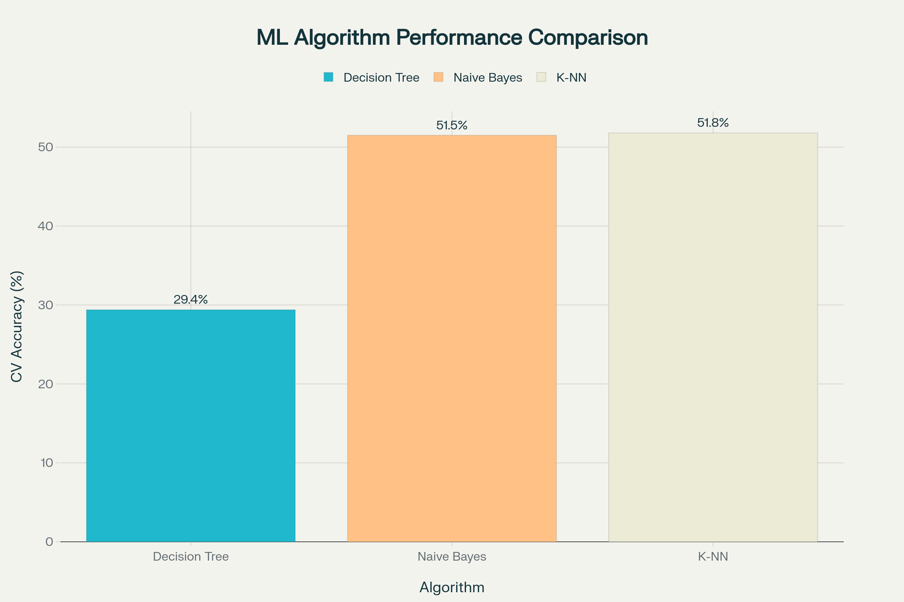

# 💊 ML-Enhanced Pharmaceutical Recommendation System

An intelligent and interactive web-based recommendation system for pharmaceutical products, powered by modern machine learning techniques. Users can enter symptoms or medicine names to get smart, tailored suggestions.

> Author: **Akash Thakur**  
> Technologies: Python (ML), HTML/CSS/JS (Frontend), scikit-learn, TF-IDF, KMeans, KNN

---

## 🚀 Features

- **🔍 Intelligent Search**: Input symptoms like “fever headache” to get top medicine recommendations
- **🧠 ML-Driven Engine**:
  - **Content-Based Filtering** (TF-IDF + Cosine Similarity)
  - **K-Means Clustering** (on price and rating)
  - **Classification Algorithms** (Decision Tree, Naive Bayes, K-NN)
  - **Hybrid Model** combining all above
- **🧪 Filter Controls**: Real-time filtering by price and rating
- **📈 Performance Insights**: ML performance graph displayed in UI
- **📊 Dataset**: 31 curated medicines with features like indications, price, rating, and category

---

## 🧬 ML Algorithm Performance

| Algorithm      | CV Accuracy (%) |
| -------------- | --------------- |
| Decision Tree  | 29.4            |
| Naive Bayes    | 51.5            |
| K-NN           | 51.8            |

---

## 🌐 Web Interface

Built using `HTML`, `CSS`, and `JavaScript`, with a responsive UI and engaging interactivity.  
Real-time features include:
- 🔄 Dynamic results section with loading state
- 🧠 Search powered by ML logic
- 🎯 Filterable by price and rating



---

## 🧪 How to Run (Python)

Install required libraries and run the backend logic:

```bash
pip install pandas scikit-learn numpy
```

```python
from ml_pharmaceutical_system import PharmaceuticalMLSystem

ml_system = PharmaceuticalMLSystem()
ml_system.load_data()
ml_system.setup_content_based_filtering()
ml_system.setup_clustering()
ml_system.setup_classification()

# Example recommendation
recommendations = ml_system.get_comprehensive_recommendations(
    user_query="fever headache",
    max_price=100,
    min_rating=4.0
)
print(recommendations)
```

More examples in [`ml_usage_guide.md`](ml_usage_guide.md)

---

## 📂 File Structure

```
📁 project-root/
├── app.js                    # JavaScript ML logic for frontend
├── index.html                # Main web interface
├── style.css                 # Themed styling and layout
├── ml_pharmaceutical_system.py  # Core ML logic in Python
├── simple_recommender.py    # Lightweight recommender logic
├── simple_medicines.csv     # Dataset of 31 medicines
├── ml_algorithm_performance.png # Accuracy bar graph
├── ml_usage_guide.md        # ML usage instructions
└── simple-medicine-recommender.md # Lite system doc
```

---

## ✅ Future Enhancements

- Expand dataset (500+ medicines)
- Add dosage and side-effect information
- Enable user feedback and rating system
- Introduce RESTful API for ML backend
- Improve clustering with PCA or t-SNE for dimensionality reduction

---

## 📜 License

This project is open-sourced for educational use. Feel free to use, modify, and build on it.
